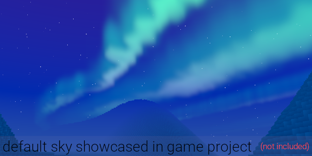

# Bevy Sky Gradient
[](https://crates.io/crates/bevy_sky_gradient)
[](https://docs.rs/game_stat/latest/game_stat/)
[](./LICENSE)
[](https://crates.io/crates/bevy_sky_gradient)

A simple and beautiful procedural sky shader for the Bevy game engine.



## Features

- **Skybox:** Everything is rendered using skyboxes. Supports gradient coloring, sun, stars, and auroras.
- **Day-Night Cycle:** Animate the sky from sunrise to sunset and through the night. You can easily configure the duration of the cycle.
- **Procedural Sun:** A sun that moves across the sky, synchronized with the day-night cycle, casting a directional light in your scene.
- **Stars & Auroras:** As night falls, stars and procedural auroras will light up the sky.
- **Modular by Design:** Enable or disable features you don't need. If you want a static sky, you can disable the day-night cycle. If you don't need auroras, you can remove them to save performance.
- **Easy Customization:** Modify sky parameters at runtime to change its appearance dynamically.

## Quick Start

Add the `bevy_sky_gradient` crate to your `Cargo.toml`:
```toml
[dependencies]
bevy_sky_gradient = "0.2.0"
```

Then, add the `SkyPlugin` to your app and add the `SkyboxMagnetTag` to your camera.

```rust
use bevy::prelude::*;
use bevy_sky_gradient::prelude::*;

fn main() {
    App::new()
        .add_plugins(DefaultPlugins)
        // Add the SkyPlugin with all features enabled
        .add_plugins(SkyPlugin::default())
        .add_systems(Startup, setup)
        .run();
}

fn setup(mut commands: Commands) {
    // Spawn a camera
    commands.spawn((
        Camera3dBundle {
            transform: Transform::from_xyz(-2.0, 2.5, 5.0).looking_at(Vec3::ZERO, Vec3::Y),
            ..default()
        },
        // Add this tag to make the skybox follow the camera
        SkyboxMagnetTag,
    ));
}
```

## Customization

`bevy_sky_gradient` is designed to be modular. You can easily enable, disable, or configure features using the `SkyPlugin::builder()`.

```rust
SkyPlugin::builder()
  .set_sun_driver(SunDriverPlugin{
    sun_settings: SunSettings{ sun_color: vec4(1.0,1.0,0.0,1.0), ..default()}
    ..default()
  })
  .set_aurora(AuroraPlugin {
    aurora_settings: AuroraSettings {
      render_texture_percent: 0.25, // Render at 25% resolution
      ..default()
  },
  .set_cycle(SkyCyclePlugin::default())
  .set_gradient_driver(GradientDriverPlugin::default())
  .set_ambient_driver(AmbientDriverPlugin:::default())

}).build(),
```

## Features Explained

- **Sky Cycle (`SkyCyclePlugin`):** This plugin introduces a timer that drives the day-night cycle. It controls the position of the sun and the color of the sky gradient. You can customize the length of the day, night, sunrise, and sunset via the `SkyTimeSettings` resource.

- **Sun Driver (`SunDriverPlugin`):** This plugin spawns a `DirectionalLight` entity and updates its position and intensity based on the time of day from the `SkyCyclePlugin`. It also updates the sun's appearance in the skybox shader.

- **Aurora (`AuroraPlugin`):** This plugin adds a beautiful procedural aurora effect to the night sky. The aurora is rendered to a separate texture for better performance and is then blended with the main skybox. You can adjust the render quality of the aurora via the `AuroraSettings` resource.

- **Rendering to a Texture:** For advanced use cases like screen-space fog or reflections, you can have the skybox render to a texture instead of directly to the screen. Use the `.with_render_sky_to_texture()` method on the `SkyPluginBuilder`.


## Bevy support table

| bevy | Bevy Sky Gradient |
| ---- | ------------------- |
| 0.17 | 0.2.0               |
| 0.16 | 0.1.0               |

## License

This project is licensed under either of

- Apache License, Version 2.0, ([LICENSE-APACHE](LICENSE-APACHE) or http://www.apache.org/licenses/LICENSE-2.0)
- MIT license ([LICENSE-MIT](LICENSE-MIT) or http://opensource.org/licenses/MIT)

at your option.
